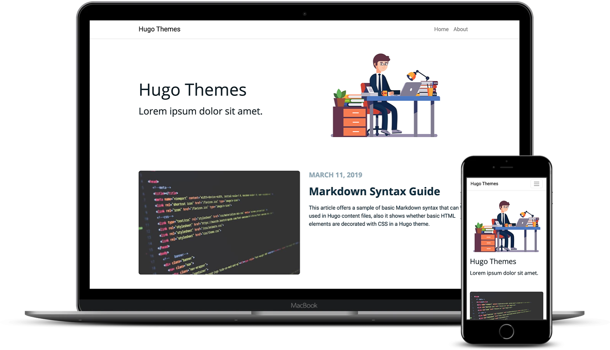

# Chunky poster

A bootstrap 4 based theme. The structure and design is based on the [Prisma blog](https://www.prisma.io/blog/).

# Screenshot



# Features

* Multi-author
* Image processing
* Basic i18n
* Prism

# Usage

```shell
git clone https://gitlab.com/virtualcursor/chunky-poster.git
```

Check out the configuration at [`exampleSite/config.toml`](exampleSite/config.toml) for configuring your Hugo site.

## Authors

The authors structure is based on this [blog post](https://www.netlify.com/blog/2018/07/24/hugo-tips-how-to-create-author-pages/).

1. Add the taxonomy ["author"](exampleSite/config.toml#L28).
2. `hugo new authors/john-doe/_index.md`
3. Configure the author metadata `twitter`.
4. Configure the author metadata `images`. First image on the list will be used as the avatar and on the profile page. Images are page resources under the author e.g. `content/authors/john-doe/image.png`.
5. Assign the author to a content:

    ```yaml
    ...
    authors: ["John Doe"]
    ...
    ```

## Content images

The images structure is based on this [blog post](https://forestry.io/blog/how-to-use-hugo-s-image-processing-with-forestry/).

Upload the images that will be used on content pages under `content/images` and create the file `content/images/index.md` with the front matter:

```yaml
---
headless: true
---
```

Set the path to the image in a `post` content under the `images` property:

```yaml
...
images: ["/images/image.png"]
...
```

The first image on the list will be used as the "cover" image on a post.

## Prism

Configure [Prism](https://prismjs.com/) under `[params.prismJS]`. Set `enable` to `true` and **disable `codeFences`**. Change the theme under `theme`.

```yaml
...
[params]
  ...
  [params.prismJS]
    enable = true
    theme = "okaidia"
...
[markup]
  [markup.highlight]
    codeFences = false
...
```

# Customization

Fork the project and run `yarn watch` during development.

The application javascript file is located at `src/js/app.js`.

For customizing SCSS, the main entrypoint is at `src/scss/style.scss`. Bootstrap variables can be overridden in the `_variables.scss` file. The theme's styles are located at `src/scss/chunky-poster.scss`.

# Credits

* [Victor Hugo](https://github.com/netlify-templates/victor-hugo)
* [hugo-theme-even](https://github.com/olOwOlo/hugo-theme-even)
* [Blank](https://github.com/vimux/blank/)

Images from [Unsplash](https://unsplash.com/) and [Freepik](https://www.freepik.com/).

# License

This theme is released under the [MIT license](LICENSE).
